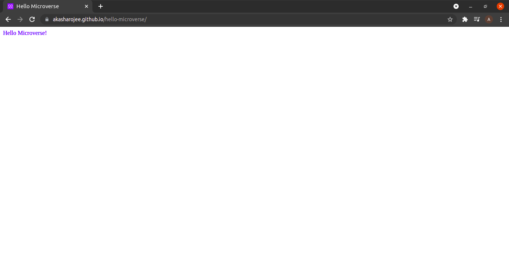

# Hello Microverse

> Set up a "Hello Microverse" project

This project serves as an introduction to tools and best practices to be used in Microverse projects.

- Using branches
- Setting up linters
- Specifying which files to not track
- Applying GitHub flow
- Writing proper README, commit messages and pull requests
- Submitting projects for code reviews

## Built With

- Major languages: HTML, CSS
- Frameworks: none
- Technologies used: Lighthouse, Webhint, Stylelint

## Live Demo

[Live Demo Link](https://akasharojee.github.io/hello-microverse/)

## Getting Started

To get a local copy up and running follow these simple example steps.

### Prerequisites

- Node.js and npm
- Lighthouse
- Webhint
- Stylelint

### Setup

- Work on feature branch
- Add .gitignore
- Add config files for linters
- Add HTML and CSS files

### Install

- Install Node Version Manager
- Install Node.js
- Install linters: Lighthouse, Webhint, Stylelint

### Usage

To run Lighthouse audit: lighthouse <url>

To run Webhint: npx hint .

To run Stylehint: npx stylelint "**/*.{css,scss}"

### Deployment

Open pull request according to Microverse guidelines.

## Authors

👤 **Akasha Rojee**

- GitHub: [@AkashaRojee](https://github.com/AkashaRojee)
- Twitter: [@AkashaRojee](https://twitter.com/AkashaRojee)
- LinkedIn: [Akasha Rojee](https://linkedin.com/in/AkashaRojee)

## 🤝 Contributing

Contributions, issues, and feature requests are welcome!

Feel free to check the [issues page](https://github.com/AkashaRojee/hello-microverse/issues).

## Show your support

Give a ⭐️ if you like this project!

## Acknowledgments

- Microverse students who helped one another figuring out working with linters :clap:

## 📝 License

This project is [MIT](./MIT.md) licensed.